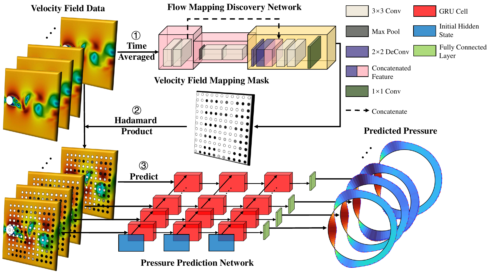

# MSU
### [Paper](https://www.ieee-jas.net/en/article/id/41a2b1a3-7c6c-4bce-8dd3-c76813e64c69) | [Project Page](https://github.com/zhangzm0128/MSU) 

> MSU: Mapping Network-coordinated Stacked Gated Recurrent Units for Turbulence Prediction

> [Zhiming Zhang](https://zhangzm0128.github.io/), [Shangce Gao](https://toyamaailab.github.io/), [MengChu Zhou](https://scholar.google.com/citations?user=KUkpv6oAAAAJ&hl=zh-CN), Mengtao Yan, Shuyang Cao

Accurately predicting fluid forces acting on the surface of a structure is crucial in engineering design. The task becomes particularly challenging in turbulent flow due to the complex and irregular changes in the flow field. The Mapping Network-coordinated Stacked Gated Recurrent Units (MSU) project addresses this challenge by introducing a novel deep learning method for predicting pressure on a circular cylinder from single velocity point. Unlike other methods, MSU can use a single velocity point to predict, which is a ground-breaking study both in deep learning and physics.

## Overview


The Flow Mapping Discovery Network generates a velocity field mapping mask using time-averaged velocity field data. This mask is a matrix with the same size as the input velocity data, where each point indicates whether the corresponding point is activated. The values in the mask range from 0 to 1, with 0 representing inactivation and 1 representing activation.

Following the Mapping Discovery Network, the mapping mask containing a velocity-pressure mapping is added to the input velocity using the Hadamard product. This guides the Prediction Network to follow the established mapping relationship. The Prediction Network leverages the capabilities of Recurrent Neural Networks (RNN) to accurately predict pressure on the surface of the cylinder using velocity data.

## Prediction Results


From the visual representation in the figure, it is evident that MSU consistently and accurately predicts the pressure, closely mirroring CFD (computational fluid dynamics) results for all moments and sides.


## Requirements

* Python 3.6 or higher is required.
* Ubuntu 16.04 or higher is required.
* This project is based on PyTorch.


## Example

### Train

```shell
python main.py --config ./config.json --checkpoint None --mode train --device cuda
```

## Citing MSU
Zhiming Zhang, Shangce Gao, MengChu Zhou, Mengtao Yan, and Shuyang Cao, “Mapping Network-coordinated Stacked Gated Recurrent Units for Turbulence Prediction,” IEEE/CAA Journal of Automatica Sinica, 2024. DOI: 10.1109/JAS.2024.124335.
```bib
@article{zhang2024mapping,
  author={Zhiming Zhang,Zhenyu Lei,Masaaki Omura,Hideyuki Hasegawa,Shangce Gao},
  title={Mapping Network-coordinated Stacked Gated Recurrent Units for Turbulence Prediction},
  journal={IEEE/CAA Journal of Automatica Sinica},  
  year={2024},
  doi={10.1109/JAS.2024.124335}
}
```
